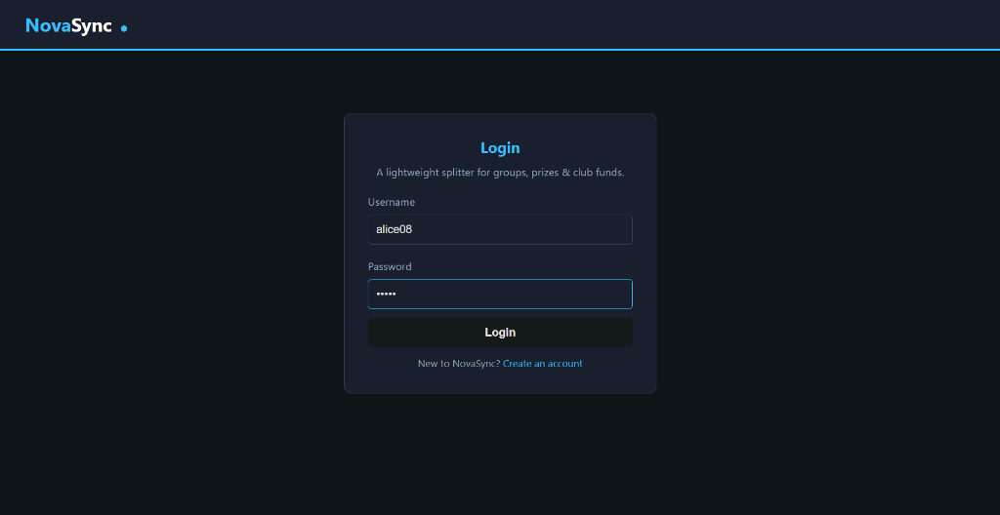
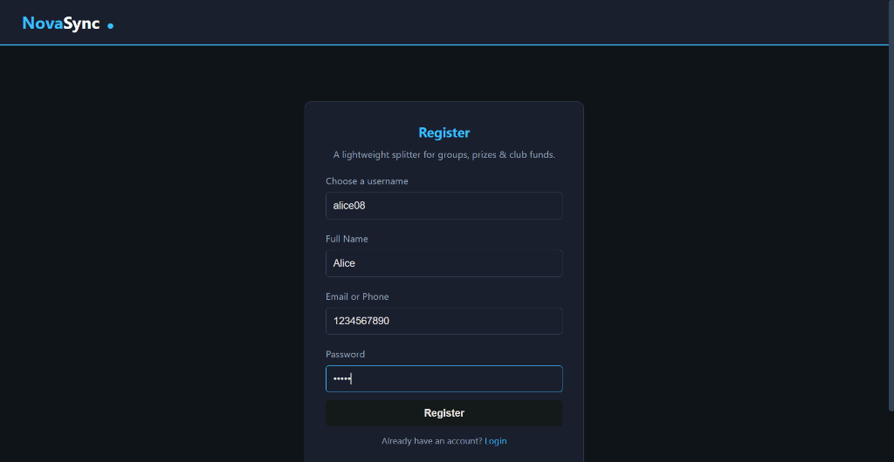
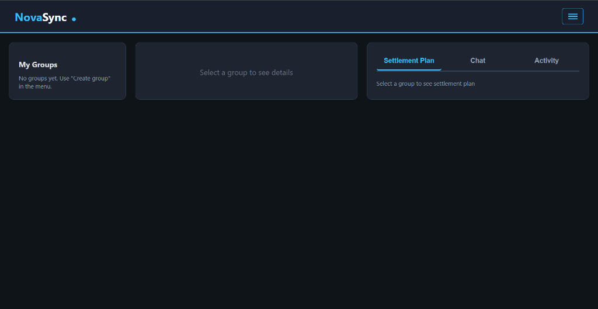
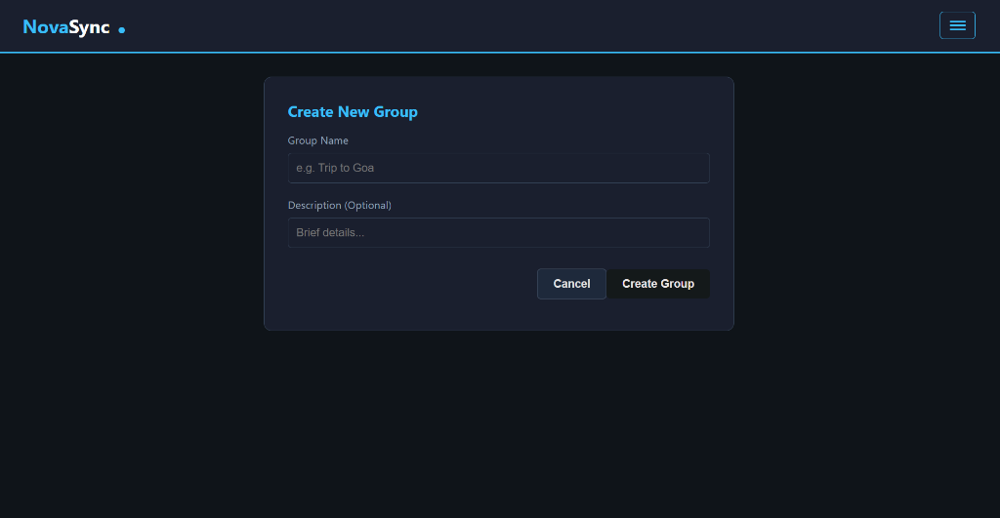
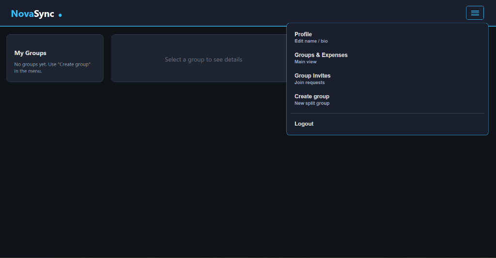
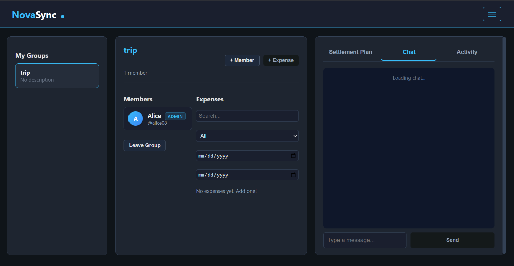
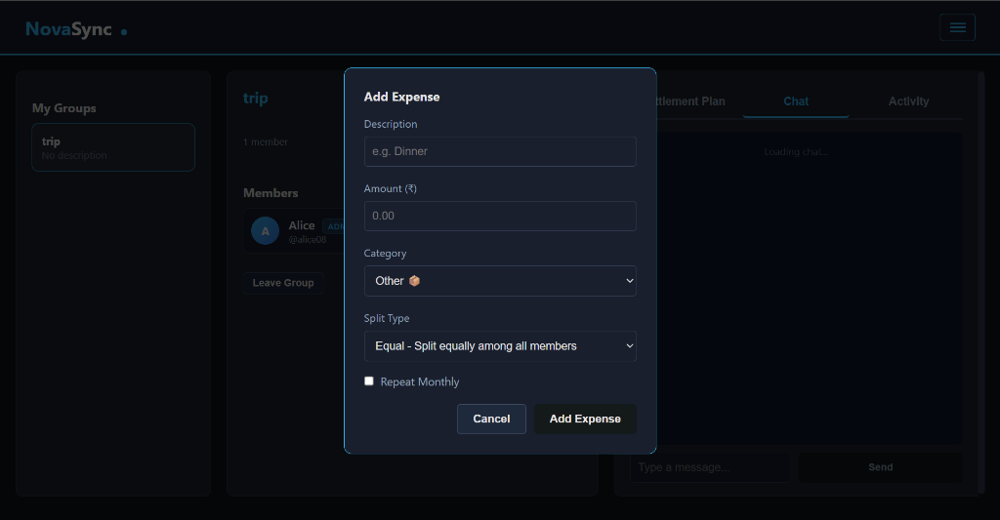
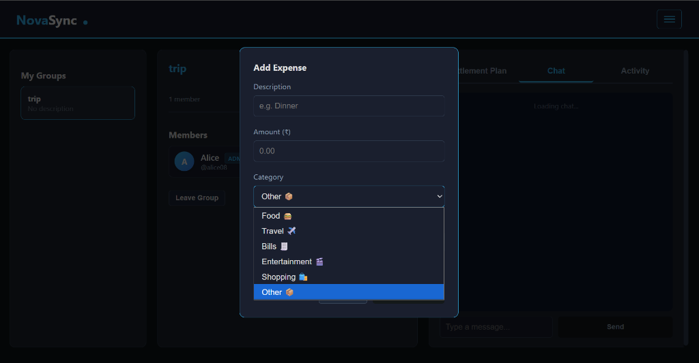
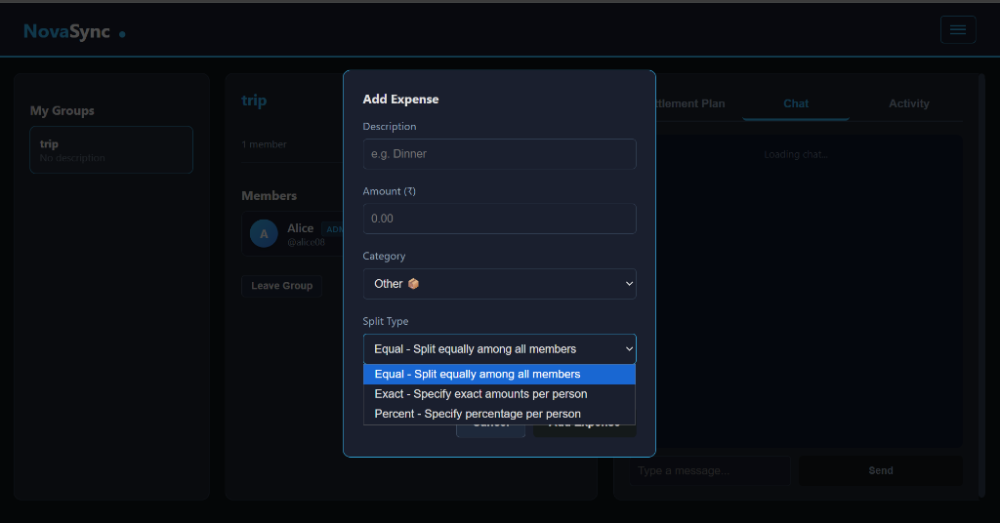
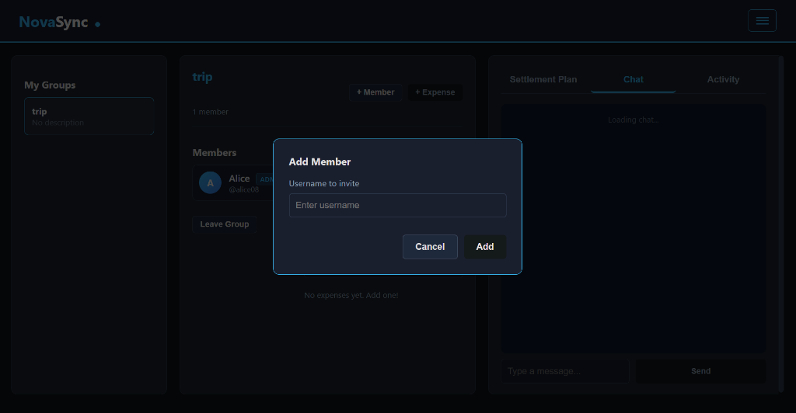

# NovaSync - Expense Splitting Application

> **“Nova”** means a sudden burst of light; **“Sync”** means harmony in motion. Together, they evoke scattered energies finding alignment — just like individual expenses settling into a balanced, unified whole.

---

## 📌 Project Overview and Problem Statement

### The Problem
Managing shared expenses in groups (trips, flatmates, events) is notoriously chaotic.
- **Manual Calculation Errors**: "Who owes whom?" becomes a complex math problem with multiple people.
- **Transaction Overhead**: In a group of 5 people, everyone paying everyone else creates a mess of small transactions.
- **Lack of Transparency**: Paper trails get lost, leading to disputes and awkwardness.

### The Solution: NovaSync
NovaSync is a **smart expense splitter** that restores harmony to group finances.
- **Centralized Tracking**: Log expenses in real-time, categorized and searchable.
- **Debt Simplification**: The core engine uses a **greedy algorithm** to minimize the total number of transactions required to settle up.
- **Transparent Records**: A reliable audit trail of every split, edit, and settlement.

---

## 🚀 Setup and Installation

### Prerequisites
- **Node.js** (v14 or higher)
- **MongoDB** (Local instance or Atlas URI)

### Installation Steps

1.  **Clone the Repository**
    ```bash
    git clone https://github.com/yourusername/NovaSync.git
    cd NovaSync
    ```

2.  **Backend Setup**
    ```bash
    cd backend
    npm install
    ```
    - Create a `.env` file in the `backend/` directory:
      ```env
      MONGO_URI=mongodb://localhost:27017/novasync
      JWT_SECRET=your_super_secret_key_123
      PORT=5000
      ```
    - Start the Server:
      ```bash
      node server.js
      ```

3.  **Frontend Setup**
    - The frontend is built with **Vanilla JS** and requires no build step.
    - Simply open `frontend/index.html` in your browser.
    - *Recommended*: Use **Live Server** extension in VS Code for the best experience.

---

## 📖 Usage Guide and Features

### 1. User Authentication
- **Secure Registration**: Sign up with a username, full name, and password.
- **JWT Content**: Sessions are maintained securely using JSON Web Tokens.

### 2. Group Management
- **Create Groups**: Organize expenses by event (e.g., "Goa Trip", "Apartment 101").
- **Invite Members**: Add friends using their unique usernames.

### 3. Expense Logging
- **Detailed Entries**: Add description, amount, date, and category (Food, Travel, etc.).
- **Flexible Splitting**:
    - **Equal Split**: Automatically divides amount by member count.
    - **Exact Amount**: Specify exactly how much each person owes.
    - **Percentage**: Split by custom percentages.
- **Recurring Expenses**: Mark bills like Rent or Netflix to repeat monthly.

### 4. The Settlement Plan (Core Feature)
- Go to the **Settlement Plan** tab to see who needs to pay whom.
- The app calculates the **minimum number of transfers** to settle all debts.
- *Example*: Instead of A paying B, and B paying C, the system might tell A to pay C directly.

---

## API Documentation
See [API_DOCUMENTATION.md](./API_DOCUMENTATION.md) for complete API reference.

## 🎥 Demo Video / Deployed Link

### 🌐 [Live Deployment: https://novasync.onrender.com](https://novasync.onrender.com)

## 📸 Screenshots

| Login Page | Registration |
|:---:|:---:|
|  |  |

| Dashboard | Create Group |
|:---:|:---:|
|  |  |

| Menu | Group View |
|:---:|:---:|
|  |  |

| Add Expense | Expense Categories |
|:---:|:---:|
|  |  |

| Split Types | Add Member |
|:---:|:---:|
|  |  |

## 🛠️ Technology Stack

| Component | Technology | Reasoning |
| :--- | :--- | :--- |
| **Frontend** | **HTML5, CSS3** | Semantic structure and custom "Dark Mode" styling without frameworks for raw performance. |
| | **Vanilla JavaScript** | distinct separation of concerns and lightweight DOM manipulation. |
| **Backend** | **Node.js + Express** | Scalable, non-blocking I/O event loop perfect for handling concurrent API requests. |
| **Database** | **MongoDB + Mongoose** | Flexible schema design to handle complex relationships between Users, Groups, and Expenses. |
| **Auth** | **JWT + Bcrypt** | Industry-standard stateless authentication and password hashing. |

---

## 🧠 The Algorithm (Technical Highlight)
NovaSync treats the group as a graph where users are nodes and debts are directed edges. 
1.  **Net Flow Calculation**: It calculates the net balance (`To Receive` - `To Pay`) for each user.
2.  **Greedy Minimization**: It iteratively matches the user with the highest negative balance (debtor) to the user with the highest positive balance (creditor), settling the smaller of the two amounts.
3.  **Result**: This reduces a graph of `N*(N-1)` potential transactions to at most `N-1`.

---

## 🤝 Credits and Attributions

This project was built from scratch, but I acknowledge the following open-source tools and assets:

### Third-Party Assets
- **FontAwesome (Free Tier)**: Used for UI icons (Trash, Edit, User, etc.).  
  *Source: [fontawesome.com](https://fontawesome.com)*
- **Google Fonts**: Used 'Inter' and 'Outfit' typefaces.  
  *Source: [fonts.google.com](https://fonts.google.com)*

### Libraries & Dependencies
- **Express.js**: Fast, unopinionated web framework for Node.js.  
  *License: MIT*
- **Mongoose**: Elegant mongodb object modeling for node.js.  
  *License: MIT*
- **Bcrypt.js**: Optimized bcrypt in JavaScript with zero dependencies.  
  *License: MIT*
- **JsonWebToken**: Implementation of JSON Web Tokens.  
  *License: MIT*

### Development Tools
- **Google Gemini**: Served as an AI Pair Programmer for debugging complex async logic and refining CSS aesthetics.
- **Mermaid.js**: Used for generating architecture diagrams in documentation.
