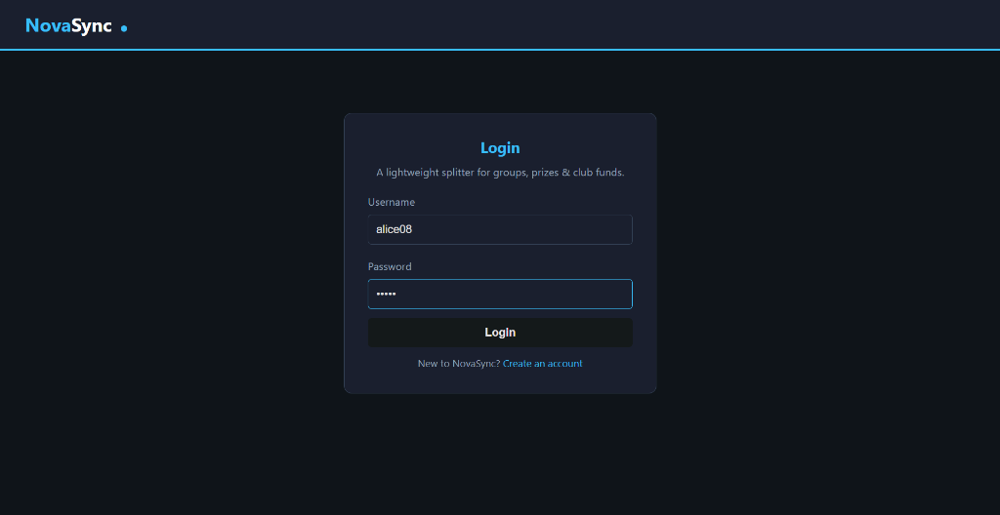
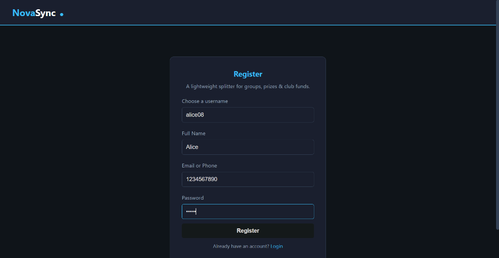
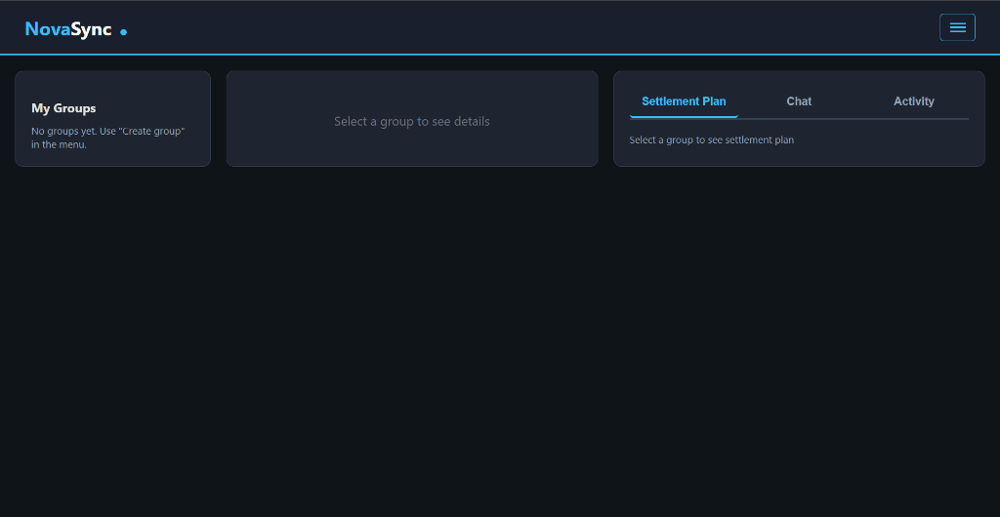
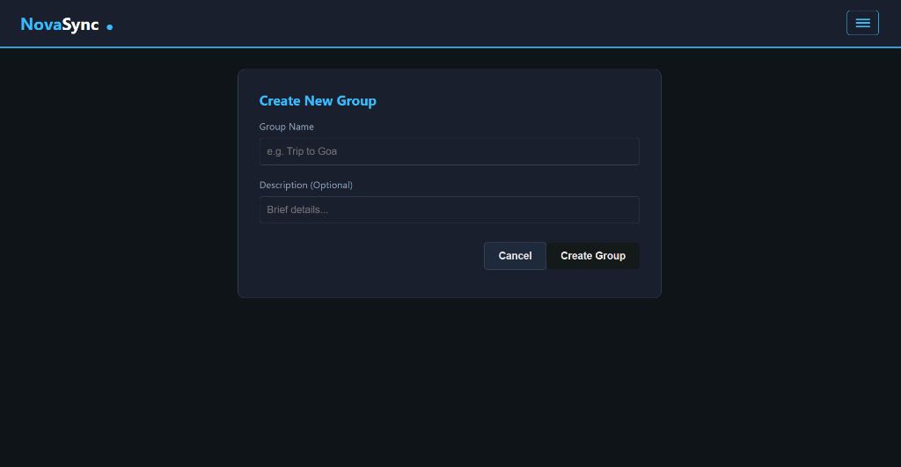
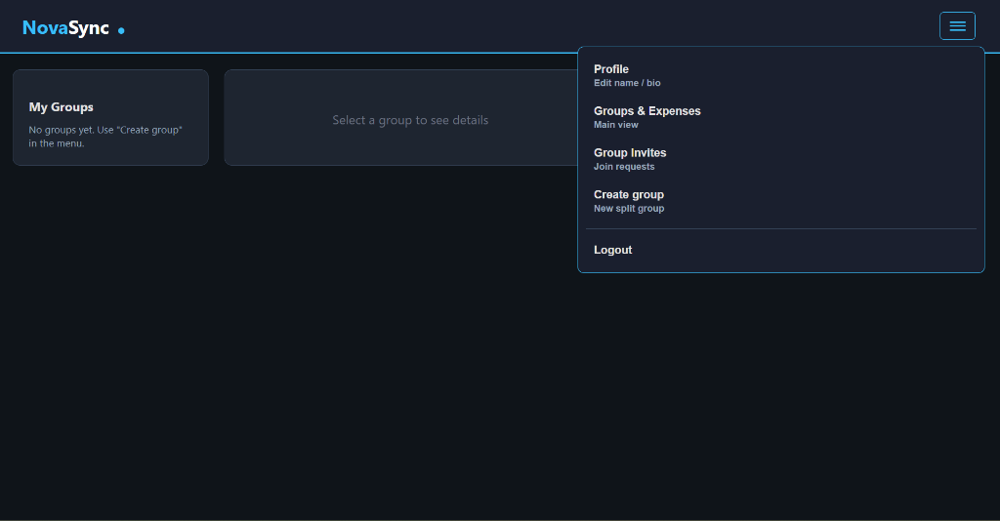
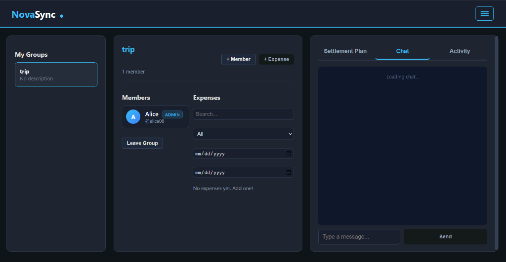
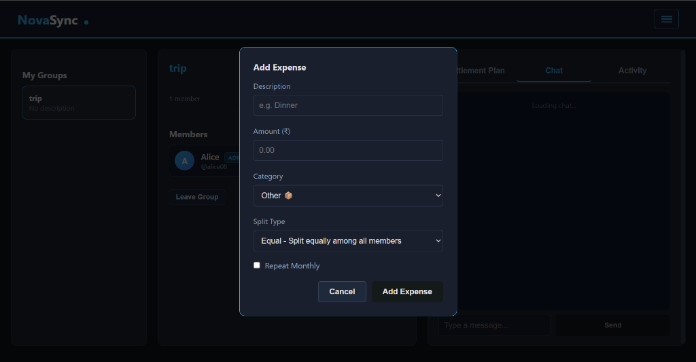
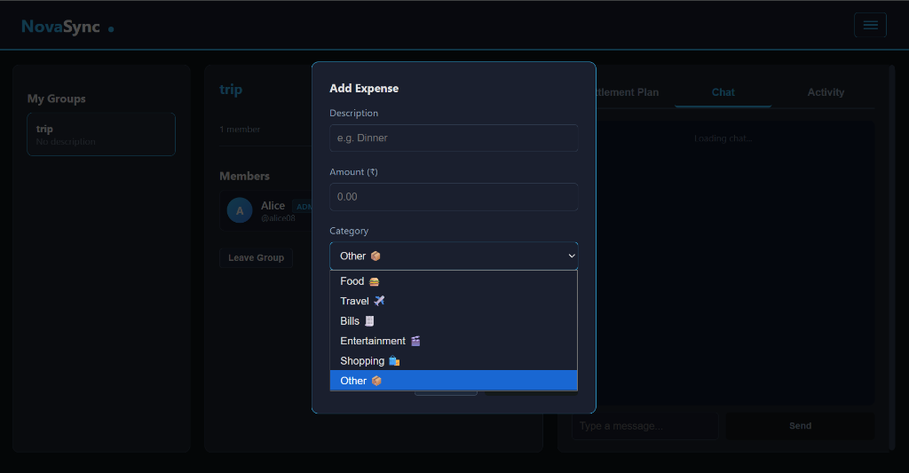
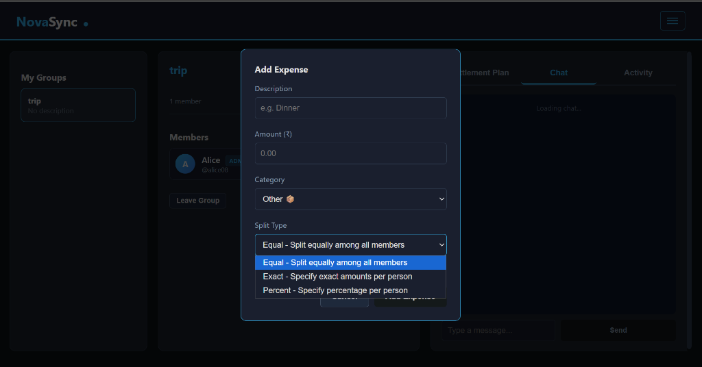
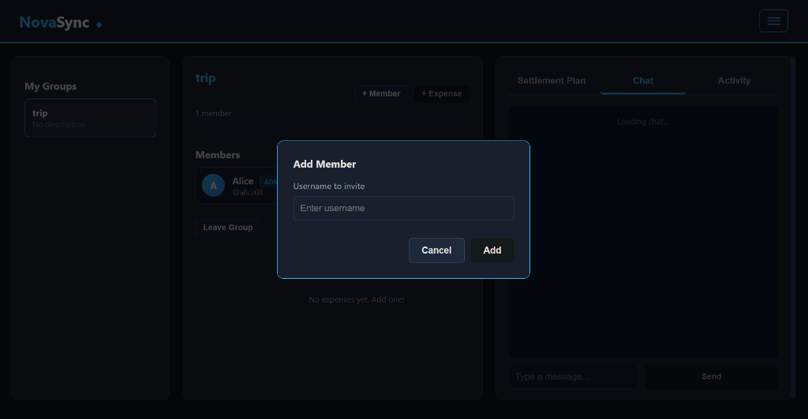

# NovaSync — Expense Splitting Application

[](https://github.com/Nandansai08/NovaSync/actions)
[](./LICENSE)
[](./CHANGELOG.md)
[](./CONTRIBUTING.md)

> **"Nova"** means a sudden burst of light; **"Sync"** means harmony in motion. Together, they evoke scattered energies finding alignment — just like individual expenses settling into a balanced, unified whole.

NovaSync is a smart group expense splitter that turns "who owes whom?" into a solved problem — it tracks shared expenses, supports equal/exact/percentage splits, and computes the minimum number of payments needed to settle every debt in a group.

---

## Table of Contents

- [Problem & Solution](#problem--solution)
- [Features](#features)
- [Live Demo](#live-demo)
- [Tech Stack](#tech-stack)
- [Getting Started](#getting-started)
- [Project Structure](#project-structure)
- [API Documentation](#api-documentation)
- [Screenshots](#screenshots)
- [The Algorithm](#the-algorithm-technical-highlight)
- [Roadmap](#roadmap)
- [Contributing](#contributing)
- [Security](#security)
- [License](#license)
- [Credits & Attributions](#credits-and-attributions)

---

## Problem & Solution

### The Problem
Managing shared expenses in groups (trips, flatmates, events) is notoriously chaotic.
- **Manual Calculation Errors**: "Who owes whom?" becomes a complex math problem with multiple people.
- **Transaction Overhead**: In a group of 5 people, everyone paying everyone else creates a mess of small transactions.
- **Lack of Transparency**: Paper trails get lost, leading to disputes and awkwardness.

### The Solution: NovaSync
NovaSync is a **smart expense splitter** that restores harmony to group finances.
- **Centralized Tracking**: Log expenses in real-time, categorized and searchable.
- **Debt Simplification**: The core engine uses a **greedy algorithm** to minimize the total number of transactions required to settle up.
- **Transparent Records**: A reliable audit trail of every split, edit, and settlement.

---

## Features

- **Secure authentication** — registration, login, and JWT-based sessions (`backend/controllers/authController.js`)
- **Group management** — create groups, invite members by username, leave or remove members (`backend/controllers/groupController.js`)
- **Flexible expense logging** — `EQUAL`, `EXACT`, and `PERCENT` split types with category tagging (Food, Travel, Bills, Entertainment, Shopping, Other)
- **Recurring expenses** — mark an expense as monthly-recurring and NovaSync auto-generates the next occurrence (`processRecurringExpenses` in `backend/controllers/expenseController.js`)
- **Settlement Plan** — a greedy debt-simplification engine reduces N\*(N-1) potential transactions down to at most N-1 (`backend/services/settlementService.js`)
- **Group chat / comments** — lightweight in-group messaging tied to each expense thread (`backend/controllers/commentController.js`)
- **Activity feed** — audit log of group creation, member changes, and expense edits (`backend/models/Activity.js`)
- **Search & filters** — filter group expenses by description, category, and date range

---

## Live Demo

🌐 **[https://novasync.vercel.app](https://novasync.vercel.app)** *(placeholder — replace with your deployed URL once live)*

---

## Tech Stack

| Component | Technology | Reasoning |
| :--- | :--- | :--- |
| **Frontend** | HTML5, CSS3 | Semantic structure and custom "Dark Mode" styling without frameworks. |
| | Vanilla JavaScript | Lightweight DOM manipulation, no build step required. |
| **Backend** | Node.js + Express | Scalable, non-blocking I/O for concurrent API requests. |
| **Database** | MongoDB + Mongoose | Flexible schema design for Users, Groups, Expenses, and Activity. |
| **Auth** | JWT + Bcrypt | Stateless authentication and password hashing. |

---

## Getting Started

### Prerequisites
- **Node.js** v14 or higher
- **MongoDB** — a local instance or a [MongoDB Atlas](https://www.mongodb.com/atlas) URI
- A modern browser (no build tooling needed for the frontend)

### 1. Clone the repository
```bash
git clone https://github.com/Nandansai08/NovaSync.git
cd NovaSync
```

### 2. Backend setup
```bash
cd backend
npm install
```

Create a `.env` file in `backend/` (see `backend/.env.example` for the template):
```env
MONGO_URI=mongodb://localhost:27017/novasync
PORT=5000
JWT_SECRET=some_secret_here
```

Start the server:
```bash
npm start
# or: node server.js
```
The API will be available at `http://localhost:5000/api`.

### 3. Frontend setup
The frontend is built with vanilla HTML/CSS/JS and requires no build step.
```bash
cd frontend
```
- Open `frontend/index.html` directly in your browser, **or**
- Use the **Live Server** extension in VS Code for auto-reload during development.

> Note: the frontend's `API_BASE` constant in `frontend/assets/js/app.js` must point at your running backend (defaults to `http://localhost:5000/api`).

---

## Deploying to Vercel

The repo ships with a `vercel.json` that deploys the Express API as a serverless function (`api/index.js`) and serves the `frontend/` directory statically from Vercel's CDN.

1. Import the repository at [vercel.com/new](https://vercel.com/new) (or run `npx vercel` from the repo root). No framework preset or build command is needed — the config in `vercel.json` handles routing.
2. In the Vercel project settings, add these **Environment Variables**:
   - `MONGO_URI` — your MongoDB connection string (use [MongoDB Atlas](https://www.mongodb.com/atlas); a local MongoDB is not reachable from Vercel). In Atlas, allow access from anywhere (`0.0.0.0/0`) under Network Access, since serverless functions don't have fixed IPs.
   - `JWT_SECRET` — a long random string used to sign auth tokens.
3. Deploy. `/api/*` requests are handled by the serverless function; everything else falls back to `frontend/index.html`.

Because the frontend uses a relative `API_BASE` (`/api`), no frontend changes are needed — it automatically talks to the API on the same domain.

---

## Project Structure

```
NovaSync/
├── backend/
│   ├── app.js                     # Express app setup (middleware, routes)
│   ├── server.js                  # Entry point — connects DB, starts HTTP server
│   ├── config/
│   │   └── db.js                  # MongoDB connection
│   ├── controllers/
│   │   ├── authController.js      # register, login, profile, password reset
│   │   ├── groupController.js     # create/join/leave/remove group members
│   │   ├── expenseController.js   # add/list/delete expenses, recurring logic
│   │   ├── commentController.js   # group chat
│   │   └── activityController.js  # audit/activity feed
│   ├── middleware/
│   │   └── auth.js                # JWT verification middleware
│   ├── models/                    # Mongoose schemas (User, Group, GroupMember, Expense, Comment, Activity)
│   ├── routes/                     # Express routers per resource
│   └── services/
│       └── settlementService.js   # Greedy debt-simplification algorithm
├── frontend/
│   ├── index.html
│   └── assets/
│       ├── css/styles.css
│       └── js/app.js               # SPA-style vanilla JS client
├── screenshots/                    # UI screenshots referenced below
├── API_DOCUMENTATION.md
├── TECHNICAL_SUMMARY.md
└── PRESENTATION.pdf
```

---

## API Documentation

Full endpoint reference (auth, groups, expenses, comments, balances) lives in [API_DOCUMENTATION.md](./API_DOCUMENTATION.md).

---

## Screenshots

| Login Page | Registration |
|:---:|:---:|
|  |  |

| Dashboard | Create Group |
|:---:|:---:|
|  |  |

| Menu | Group View |
|:---:|:---:|
|  |  |

| Add Expense | Expense Categories |
|:---:|:---:|
|  |  |

| Split Types | Add Member |
|:---:|:---:|
|  |  |

More context and architecture diagrams are available in [TECHNICAL_SUMMARY.md](./TECHNICAL_SUMMARY.md) and [PRESENTATION.pdf](./PRESENTATION.pdf).

---

## The Algorithm (Technical Highlight)

NovaSync treats the group as a graph where users are nodes and debts are directed edges.
1. **Net Flow Calculation**: Computes the net balance (`To Receive` − `To Pay`) for each user.
2. **Greedy Minimization**: Iteratively matches the user with the highest negative balance (debtor) to the user with the highest positive balance (creditor), settling the smaller of the two amounts.
3. **Result**: This reduces a graph of `N*(N-1)` potential transactions to at most `N-1`.

See `backend/services/settlementService.js` for the implementation.

---

## Roadmap

- [ ] Receipt scanning (OCR) for auto-extracting expense details from photos
- [ ] Spending insights via lightweight clustering of categories/habits
- [ ] Push/email notifications for new expenses and settlement reminders
- [ ] Multi-currency support
- [ ] Automated test suite (unit tests for the settlement algorithm, integration tests for routes)
- [ ] CI pipeline (lint + test on every PR)
- [ ] Optional: exportable settlement history (CSV/PDF)

Have an idea? Open a [feature request](.github/ISSUE_TEMPLATE/feature_request.md).

---

## Contributing

Contributions are welcome! Please read [CONTRIBUTING.md](./CONTRIBUTING.md) for branch naming, commit conventions, and the PR checklist before opening a pull request. Also see our [Code of Conduct](./CODE_OF_CONDUCT.md).

---

## Security

If you discover a security vulnerability, please **do not** open a public issue. See [SECURITY.md](./SECURITY.md) for responsible disclosure instructions.

---

## License

This project is licensed under the MIT License. *(Add a `LICENSE` file at the repo root to finalize this — see the badge above.)*

---

## Credits and Attributions

This project was built from scratch, but acknowledges the following open-source tools and assets:

### Third-Party Assets
- **FontAwesome (Free Tier)** — UI icons. *Source: [fontawesome.com](https://fontawesome.com)*
- **Google Fonts** — 'Inter' and 'Outfit' typefaces. *Source: [fonts.google.com](https://fonts.google.com)*

### Libraries & Dependencies
- **Express.js** — Web framework for Node.js. *License: MIT*
- **Mongoose** — MongoDB object modeling. *License: MIT*
- **Bcrypt** — Password hashing. *License: MIT*
- **jsonwebtoken** — JSON Web Token implementation. *License: MIT*

### Development Tools
- **Google Gemini** — AI pair programmer for debugging async logic and refining CSS.
- **Mermaid.js** — Architecture diagrams in documentation.
