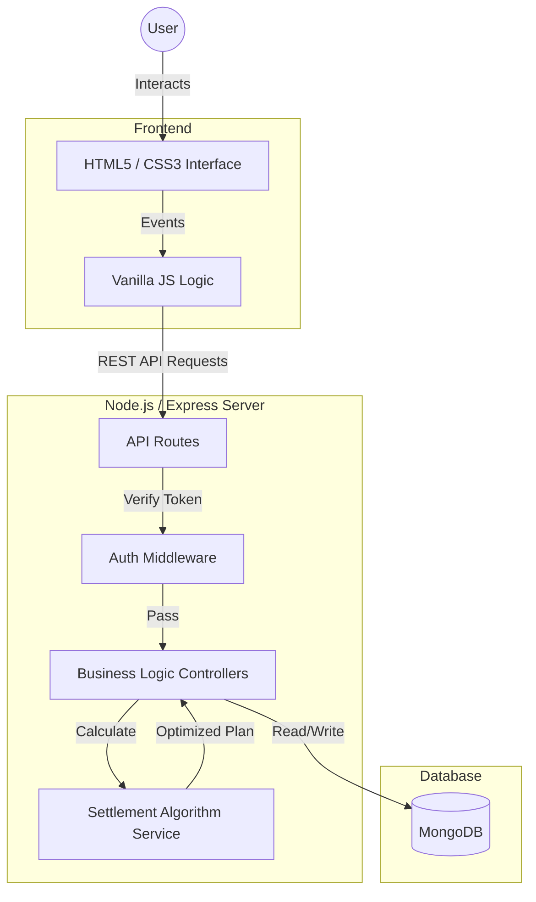

# NovaSync - Technical Summary

## 1. Project Architecture

### Overview
NovaSync follows a **Model-View-Controller (MVC)** architectural pattern, ensuring a clear separation of concerns between the data, the interface, and the business logic.

### Design Decisions
-   **Client-Side Rendering (CSR)**: I chose to simulate a Single Page Application (SPA) using Vanilla JavaScript. This provides a fast, responsive user experience without the complexity of a heavy frontend framework like React/Angular for this MVP.
-   **Stateless Authentication**: Using JWT (JSON Web Tokens) allows the backend to be stateless and scalable.
-   **Greedy Settlement Algorithm**: To minimize the number of transactions, I implemented a greedy algorithm that matches the largest debtors with the largest creditors. This is mathematically efficient for simplifying debts.

## 2. Technology Stack

| Layer | Technology | Description |
| :--- | :--- | :--- |
| **Frontend** | **HTML5, CSS3** | Semantic structure and custom "Premium" styling. |
| | **JavaScript (ES6+)** | DOM manipulation, `fetch` API for backend communication. |
| **Backend** | **Node.js** | JavaScript runtime environment. |
| | **Express.js** | Web framework for RESTful API routing. |
| **Database** | **MongoDB** | NoSQL database for flexible data schemas. |
| | **Mongoose** | ODM for checking schema validation and relationships. |
| **Security** | **JWT** | JSON Web Tokens for stateless authentication. |
| | **Bcrypt** | Password hashing. |

## 3. Third-Party Usage Disclosure

We have used the following open-source libraries and services:

-   **Backend Dependencies**:
    -   `express`: Server framework.
    -   `mongoose`: Database modeling.
    -   `bcrypt`: Security (Password hashing).
    -   `jsonwebtoken`: Security (Authentication).
    -   `cors`: Cross-Origin Resource Sharing.
    -   `dotenv`: Environment variable management.
-   **Frontend Assets**:
    -   **FontAwesome**: Used for UI icons (via CDN).
    -   **Google Fonts**: Typography (Inter / Outfit).

## 4. AI / ML / Blockchain / Cybersecurity Features

### Current Implementation Status: **Not Applicable (N/A)**
NovaSync currently relies on **deterministic algorithms** (Greedy Strategy) rather than probabilistic AI/ML models. This choice was made to ensure **100% mathematical accuracy** in financial settlements, where users expect exact figures down to the decimal.

### Future Scope (Roadmap)
-   **Receipt Scanning (OCR)**: I plan to integrate Google Cloud Vision API to automatically extract expense details from uploaded receipt images.
-   **Spending Insights (ML)**: A future update could use simple clustering (K-Means) to categorize user spending habits and suggest budget improvements.
-   **Secure Ledger (Blockchain)**: For enterprise versions, I considered using a private blockchain (Hyperledger) for immutable audit logs, though it is overkill for the current casual use case.

## 5. List of AI Tools Used

-   **Google Gemini**: Used as an AI Pair Programmer for code generation, debugging, and documentation.
-   **Mermaid.js**: For generating architecture diagrams.

## 5. Mentor / Manager Interactions and Guidance Received

-   **Guidance on Architecture**: Received mentoring on structuring the project using MVC to ensure scalability.
-   **Algorithm Review**: Verified the settlement logic to ensure edge cases (like zero balance) were handled correctly.
-   **AI Assistance**: The AI Pair Programmer (Gemini) assisted with:
    -   Structuring the project files.
    -   Debugging syntax errors in JavaScript.
    -   Refining CSS for a premium aesthetic.
